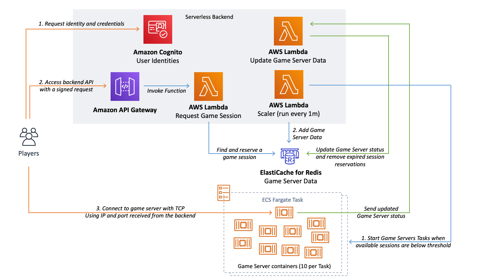

# Game Server Hosting on ECS Fargate

- [Game Server Hosting on ECS Fargate](#game-server-hosting-on-ecs-fargate)
- [Key Features](#key-features)
- [Contents](#contents)
- [Architecture Diagram](#architecture-diagram)
- [Important Notes on Service Limits and Scaling](#important-notes-on-service-limits-and-scaling)
- [Preliminary Setup](#preliminary-setup)
- [Deployment With Bash Scripts](#deployment-with-bash-scripts)
- [Deployment With Powershell Scripts](#deployment-with-powershell-scripts)
- [Implementation Overview](#implementation-overview)
  * [Infrastructure](#infrastructure)
  * [Serverless Backend Services](#serverless-backend-services)
    + [Scaler Functionality Details](#scaler-functionality-details)
    + [Game Server Status Update Functionality Details](#game-server-status-update-functionality-details)
    + [Requesting Game Session Functionality Details](#requesting-game-session-functionality-details)
  * [Game Server](#game-server)
  * [Game Client](#game-client)
- [Cleaning Up Resources](#cleaning-up-resources)
- [License](#license)

This repository contains an example solution on how to scale a fleet of Game Servers on ECS Fargate and route players to them using a Serverless backend. Game Server data is stored in ElastiCache Redis. All resources are deployed with Infrastructure as Code using CloudFormation, Serverless Application Model, Docker and bash/powershell scripts.

# Key Features
* Scales ECS Fargate Tasks based on need using a defined percentage of available game servers as the metric
* Uses ElastiCache Redis to store game server information
* Uses a Serverless API for requesting game sessions. Deployed with Serverless Application Model
* Uses CloudFormation to deploy all infrastructure resources
* Uses Cognito for player identities. Requests against the API are signed with Cognito credentials
* Uses Unity on both server and client side. Unity server build is deployed as a Linux Docker container
* Supports development and deployment on both Windows and MacOS

The client/server Unity project is a simple "game" where 2 players join the same session and move around with their 3D characters. The movements are sent through the server to other players and the characters created and removed as players join and leave.

# Contents

The project contains:
* **A Unity Project** that will be used for both Client and Server builds (`UnityProject`). Server build will be further built into a Docker container image and deployed to Elastic Container Registry as part of the deployment automation.
* **A Backend Project** created with Serverless Application Model (SAM) to create and API backend for matchmaking requests (`BackendServices`)
* **Infrastructure deployment automation** leveraging AWS CloudFormation to deploy all infrastructure resources (`CloudFormationResources`)
* **A build folder for the server build** which includes a Dockerfile for building the docker image (`LinuxServerBuild`)

# Architecture Diagram

# Important Notes on Service Limits and Scaling

This example is not a production ready solution but an example to get started. You always need to test how it performs for your specific use case.

You will be hitting some of the service limits once you start scaling to 100s or 1000s of Fargate Tasks. You can request increases to these limits in the AWS Management Console under "Service Quotas". The solution has been tested with 4000 running game servers (400 Tasks).

Limits that you will need to increase for production workloads:
* *Public IP addresses for tasks using the Fargate launch type* --> Request increase to the maximum amount of Game Server Tasks you want to run
* *Tasks using the Fargate launch type, per Region, per account* --> Request increase to the maximum amount of Game Server Tasks you want to run

**ElastiCache Scaling**

While the configuration for the ElastiCache Redis Cluster is sufficient for a large number of servers, you need to see if you need to scale it to a bigger instance for production. Also a Multi-AZ deployment for production is highly recommended.

**Fargate Task Scaling and Throttling**

You can start 10 new Tasks per one request to the ECS API and the these requests will throttle as well allowing around 1 Task/second rate of starting Tasks (with burst capacity to 10/s). This solution can start around 600 game servers (60 Tasks) per minute with the default service limits as each Task hosts 10 game server containers.

The scaling speed should be sufficient to most needs and if you run the Tasks in multiple Regions, each have their own similar scaling capabilities. In case you need even faster scaling / more available game servers you can:

 1. have a larger percentage of available game servers (configured in the Scaler Lambda function)
 2. request an increase to the run-task API limit: https://docs.aws.amazon.com/AmazonECS/latest/userguide/throttling.html
 3. increase the amount of times a game server is reused for game sessions (currently hosts 3 consecutive sessions). This will reduce the number of Tasks started to replace recycled game servers.

# Preliminary Setup

1. **Install and configure the AWS CLI**
    * Follow these instructions to install: [AWS CLI Installation](https://docs.aws.amazon.com/cli/latest/userguide/cli-chap-install.html)
    * Configure the CLI: [AWS CLI Configuration](https://docs.aws.amazon.com/cli/latest/userguide/cli-chap-configure.html#cli-quick-configuration)
2. **Install Unity3D 2019**
    * Use the instructions on Unity website for installing: [Unity Hub Installation](https://docs.unity3d.com/Manual/GettingStartedInstallingHub.html)
    * Install support for Linux builds for your Unity installation. You will need this for the server builds.
3. **Install SAM CLI**
    * Follow these instructions to install the Serverless Application Model (SAM) CLI: [SAM CLI Installation](https://docs.aws.amazon.com/serverless-application-model/latest/developerguide/serverless-sam-cli-install.html)
3. **Install Docker**
    * Follow the instructions on the Docker website to install it: [Get Docker](https://docs.docker.com/get-docker/)
4. **Install external dependencies**
    1. Download the Unity compatible AWS SDK [here](http://sdk-for-net.amazonwebservices.com/releases/aws-sdk-netstandard2.0-3.3.597.0.zip) and copy the following files to `UnityProject/Assets/Dependencies/`: `AWSSDK.CognitoIdentity.dll`, `AWSSDK.CognitoIdentityProvider.dll`, `AWSSDK.Core.dll`, `AWSSDK.Lambda.dll` and `AWSSDK.SecurityToken.dll`. See [this blog post](https://aws.amazon.com/blogs/developer/referencing-the-aws-sdk-for-net-standard-2-0-from-unity-xamarin-or-uwp/) if you need to configure the SDK yourself in another project. **NOTE**: the download link in the blog post references the latest SDK that is not currently compatible with Unity.
    2. Download the [Newtonsoft Json framework binaries](https://github.com/JamesNK/Newtonsoft.Json/releases/download/12.0.3/Json120r3.zip) and copy the file `Bin/net45/Newtonsoft.Json.dll` to `UnityProject/Assets/Dependencies/`. We will use this to serialize C# objects to Json when calling the Backend services. See [The official website](https://www.newtonsoft.com/json) for details on Newtonsoft Json framework.
    3. Download the [Signature Calculation Example from AWS Documentation](https://docs.aws.amazon.com/AmazonS3/latest/API/samples/AmazonS3SigV4_Samples_CSharp.zip): **Copy the folders** `Signers` and `Util` to `UnityProject/Assets/Dependencies/` folder. We will use these to sign the requests against API Gateway with Cognito credentials. You could implement a similar SigV4 signing process yourself. After this you should not see any errors in your Unity console.
5. **Select deployment Region**
    * The solution can be deployed to any Region supporting ECS, Fargate, Lambda, API Gateway and Cognito. See [The Regional Table](https://aws.amazon.com/about-aws/global-infrastructure/regional-product-services/) to validate your selected Region supports these services. You will need to configure the Region during the deployment.

# Deployment With Bash Scripts

1. **Set up Configuration Variables**
    * Open `configuration.sh` in your favourite text editor
    * Set the `region` variable to your desired region
    * Set the `accountid` to your AWS Account ID (12 digits without dashes)
    * Set the `deploymentbucketname` to a **globally unique** name for the code deployment bucket
2. **Deploy the Infrastructure resources**
    * Run `CloudFormationResources/deploy-vpc-ecs-and-redis-resources.sh` to deploy. This will take some time as it creates all VPC resources as well as the ElastiCache Redis cluster. The script will wait for the Stacks to be created and you can also view the status from CloudFormation Management Console.
3. **Set the RegionEndpoint to Server.cs**
    * Open `UnityProject/Assets/Scripts/Server/Server.cs` in your favourite editor
    * Set the `RegionEndpoint regionEndpoint` to your selected Region
4. **Build the server**
    * Open Unity Hub, add the UnityProject and open it (Unity 2019.2.16 or higher recommended)
    * In Unity go to "File -> Build Settings"
    * Go to "Player Settings" and find the Scripting Define Symbols ("Player settings" -> "Player" -> "Other Settings" -> "Scripting Define Symbol")
    * Replace the the Scripting Define Symbol with `SERVER`. Remember to press Enter after changing the value. C# scripts will use this directive to include server code and exclude client code
    * Close Player Settings and return to Build Settings
    * Switch the target platform to `Linux`. If you don't have it available, you need to install Linux platform support in Unity Hub.
    * Check the box `Server Build`
    * Build the project to the `LinuxServerBuild` folder (Click "Build" and in new window choose "LinuxServerBuild" folder, enter "FargateExampleServer" in "Save as" field and click "Save"). **NOTE**: It's important to give the exact name `FargateExampleServer` for the build as the Dockerfile uses this.
5. **Build Docker Image and Deploy Task Configuration**
    * Make sure you have Docker installed and running
    * Run `CloudFormationResources/deploy-game-server-and-update-task-definition.sh` to build the docker image, create an ECR repository and upload the image and deploy the Task Definition
6. **Deploy the Backend Services with SAM**
    * Make sure you have the SAM CLI installed
    * The template uses Python 3.7 for the Lambda functions so **you will need Python 3.7 installed locally as well**. [Download Python 3.7 here](https://www.python.org/downloads/release/python-379/).
    * Run the `BackendServices/deploy.sh` script to deploy the backend Services. This first deployment will take some time as the networking interfaces to the VPC are being deployed as well.
    * You should see the Scaler function starting quickly after the Stack is deployed to run every minute and 3-4 Tasks being started in the ECS Cluster, each hosting 10 game server containers
7. **Set the API endpoint to the Unity Project**
    * Set the value of `static string apiEndpoint` to the endpoint created by the backend deployment in `UnityProject/Assets/Scripts/Client/MatchmakingClient.cs`
    * You can find this endpoint from the `fargate-game-servers-backend` Stack Outputs in CloudFormation or from the API Gateway console (make sure to have the `/Prod/` in the url)
8. **Deploy Cognito Resources**
    * Run `CloudFormationResources/deploy-cognito-resources.sh` to deploy
9. **Set the Cognito Identity Pool configuration**
    * Set the value of `static string identityPoolID` to the identity pool created by the Cognito Resources deployment in `UnityProject/Assets/Scripts/Client/MatchmakingClient.cs`. (You can find the ARN of the Identity Pool in the CloudFormation stack `fargate-game-servers-cognito`, in IAM console or as output of Step 8)
    * Set the value of `public static string regionString` and `public static Amazon.RegionEndpoint region` to the values of your selected region
10. **Build and run two clients**
    * Set the the Scripting Define Symbol `CLIENT` in the *Player Settings* in the Unity Project (File -> "Build Settings" -> "Player settings" → "Player" → "Other Settings" → "Scripting Define Symbol" → Replace completely with "CLIENT")
    * Open the scene "GameWorld" in Scenes/GameWorld
    * Open Build Settings (File -> Build Settings) in Unity and set target platform to `Mac OSX` (or whatever the platform you are using) and **uncheck** the box `Server Build`
    * Build the client to any folder (Click "Build", select your folder and click "Save")
    * You can run two clients by running one in the Unity Editor and one with the created build. This way the clients will get different Cognito identities. If you run multiple copies of the build, they will have the same identity. In this solution is doesn't matter but if your backend starts using the identity for player data, then it might.
    * You should see the clients connected to the same game session and see the movements synchronized between clients.

# Deployment With Powershell Scripts

1. **Set up Configuration Variables**
    * Open `configuration.xml` in your favourite text editor
    * Set the `Region` variable to your desired region
    * Set the `AccountID` to your AWS Account ID (12 digits without dashes)
    * Set the `DeploymentBucketName` to a **globally unique** name for the code deployment bucket
2. **Deploy the Infrastructure resources**
    * Run `CloudFormationResources/deploy-vpc-ecs-and-redis-resources.ps1` to deploy. This will take some time as it creates all VPC resources as well as the ElastiCache Redis cluster. The script will wait for the Stacks to be created and you can also view the status from CloudFormation Management Console.
3. **Set the RegionEndpoint to Server.cs**
    * Open `UnityProject/Assets/Scripts/Server/Server.cs` in your favourite editor
    * Set the `RegionEndpoint regionEndpoint` to your selected Region
4. **Build the server**
    * Open Unity Hub, add the UnityProject and open it (Unity 2019.2.16 or higher recommended)
    * In Unity go to "File -> Build Settings"
    * Go to "Player Settings" and find the Scripting Define Symbols ("Player settings" -> "Player" -> "Other Settings" -> "Scripting Define Symbol")
    * Replace the the Scripting Define Symbol with `SERVER`. Remember to press Enter after changing the value. C# scripts will use this directive to include server code and exclude client code
    * Close Player Settings and return to Build Settings
    * Switch the target platform to `Linux`. If you don't have it available, you need to install Linux platform support in Unity Hub.
    * Check the box `Server Build`
    * Build the project to the `LinuxServerBuild` folder (Click "Build" and in new window choose "LinuxServerBuild" folder, enter "FargateExampleServer" in "Save as" field and click "Save"). **NOTE**: It's important to give the exact name `FargateExampleServer` for the build as the Dockerfile uses this.
5. **Build Docker Image and Deploy Task Configuration**
    * Make sure you have Docker installed and running
    * Run `CloudFormationResources/deploy-game-server-and-update-task-definition.ps1` to build the docker image, create an ECR repository and upload the image and deploy the Task Definition
6. **Deploy the Backend Services with SAM**
    * Make sure you have the SAM CLI installed
    * The template uses Python 3.7 for the Lambda functions so **you will need Python 3.7 installed locally as well**. [Download Python 3.7 here](https://www.python.org/downloads/release/python-379/).
    * Run the `BackendServices/deploy.ps1` script to deploy the backend Services. This first deployment will take some time as the networking interfaces to the VPC are being deployed as well.
    * You should see the Scaler function starting quickly after the Stack is deployed to run every minute and 3-4 Tasks being started in the ECS Cluster, each hosting 10 game server containers
7. **Set the API endpoint to the Unity Project**
    * Set the value of `static string apiEndpoint` to the endpoint created by the backend deployment in `UnityProject/Assets/Scripts/Client/MatchmakingClient.cs`
    * You can find this endpoint from the `fargate-game-servers-backend` Stack Outputs in CloudFormation or from the API Gateway console (make sure to have the `/Prod/` in the url)
8. **Deploy Cognito Resources**
    * Run `CloudFormationResources/deploy-cognito-resources.ps1` to deploy
9. **Set the Cognito Identity Pool configuration**
    * Set the value of `static string identityPoolID` to the identity pool created by the Cognito Resources deployment in `UnityProject/Assets/Scripts/Client/MatchmakingClient.cs`. (You can find the ARN of the Identity Pool in the CloudFormation stack `fargate-game-servers-cognito`, in IAM console or as output of Step 8)
    * Set the value of `public static string regionString` and `public static Amazon.RegionEndpoint region` to the values of your selected region
10. **Build and run two clients**
    * Set the the Scripting Define Symbol `CLIENT` in the *Player Settings* in the Unity Project (File -> "Build Settings" -> "Player settings" → "Player" → "Other Settings" → "Scripting Define Symbol" → Replace completely with "CLIENT")
    * Open the scene "GameWorld" in Scenes/GameWorld
    * Open Build Settings (File -> Build Settings) in Unity and set target platform to `Windows` and **uncheck** the box `Server Build`
    * Build the client to any folder (Click "Build", select your folder and click "Save")
    * You can run two clients by running one in the Unity Editor and one with the created build. This way the clients will get different Cognito identities. If you run multiple copies of the build, they will have the same identity. In this solution is doesn't matter but if your backend starts using the identity for player data, then it might.
    * You should see the clients connected to the same game session and see the movements synchronized between clients.

# Implementation Overview

## Infrastructure

The AWS Infrastructure for the solution consists of
* a **VPC** that has public subnets for game server Tasks and private subnets for ElastiCache Redis and Lambda functions that access Redis (`CloudFormationResources/ecs-resources.yaml`)
* an **ECS Cluster** that is used to host the Fargate Tasks (`CloudFormationResources/ecs-resources.yaml`)
* **ElastiCache Redis** to store the game server data in Redis Hashes which can have multiple fields (`CloudFormationResources/elasticache-redis.yaml`)
* a **Cognito Identity Pool** that is used to store the player identities (`CloudFormationResources/cognito.yaml`)
* an **ECS Fargate Task Definition** that defines the Task to be run in public subnets of the VPC using the game server image uploaded to ECR (`CloudFormationResources/game-server-task-definition.yaml`)

## Serverless Backend Services

The Serverless Backend Services are deployed with SAM (Serverless Application Model). The backend consists of
* a **scaler function** (`BackendServices/functions/scaler.py`) that will run every minute using a CloudWatch Events scheduled event. The function runs around 58 seconds and checks every 2 seconds if new game servers should be started based on the availability of game servers requested from Redis. It uses the latest Task Definition to start new Fargate Tasks in the ECS Cluster. 
* a **function to update game server state in Redis** (`BackendServices/functions/updateredis.py`) that is called directly by the game servers with AWS SDK to update their state in Redis (current players, availability etc.). This function will also free any player reservations to the server that have not been used in 30 seconds. This could be a client that requested a game session but never connected.
* a **function to request a games session** (`BackendServices/functions/requestgamesession.py`) that is called by the game client through API Gateway to request a new game session. The function will reserve a placement in one of the active or available game sessions and uses Redis Watch and Pipe functionalities to make sure these placements are done atomically
* an **API Gateway** that uses AWS_IAM authentication to authenticate game clients with their Cognito credentials

The backend service infrastructure is defined in `BackendServices/template.yaml` and is deployed with SAM using `BackendServices/deploy.sh`.

The backend CloudFormation Stack will also configure **CloudWatch Logs Metric Filters** for a number of metrics generated by the log events in the Scaler function. You will find these under the Namespace Scaler in CloudWatch Metrics. These metrics help visualize the status and availability of your game servers.

### Scaler Functionality Details

The Scaler Lambda function will fetch the keys of all game servers (stored as HSETs in Redis). It will then determine what percentage of the game servers are available and in case this percentage is below the defined threshold, it will start new Tasks. Each new Task hosts 10 game server containers so the total amount of required game servers is divided by 10 to get the Task count. Tasks are started in batches of 3 Tasks to make sure we don't reach the throttling limit of the API but still make maximum use of it. The Lambda function will check Redis every 2 seconds resulting in a maximum of 3 Tasks per 2 seconds being started which based on tests doesn't introduce throttling. This gives a theoretical maximum of around 900 game servers started per second.

**Note**: If you change the amount of containers per Task, you need to update this to `BackendServices/functions/scaler.py` as well. Use the variables defined in the beginning of the script for minimum amount of game servers as well as the minimum percentage of available game servers.

Exactly one copy of the Scaler function is running at any given time, which is ensured by limiting the concurrency with `ReservedConcurrentExecutions` in `BackendServices/template.yaml`. The function is scheduled to run every 1 minute in the same template (and will run almost a full minute as well).

The Scaler function runs in the same VPC as the ElastiCache Redis cluster with Security Groups configured to allow access from the Lambda Security Group to the Redis port in the ElastiCache Security Group.

### Game Server Status Update Functionality Details

Each Game Server Process will Invoke a Lambda function named FargateGameServersUpdateGameServerData every 15 seconds to update their status to Redis. This is done in `UpdateRedis` method in `UnityProject/Assets/Scripts/Server/Server.cs`. The method is called also always when we have a known state change on the server side to make sure it is immediately reflected in Redis. The Lambda Function is called using the IAM Role of the Task and the AWS SDK.

The Lambda Function `BackendServices/functions/updateredis.py` will do the actual update. The game server is always at exactly one state and all the other state hashes are deleted from Redis on update. The possible different statuses that a game server can have are:

* *Available*: The game server is **available for new game sessions**. The `ready` attribute in the Hash will define if the game server is fully initialized
* *Available Priority*: The game server is available and it is **running on a Task that has already hosted game sessions**. These game servers are prioritized when placing sessions to make sure Tasks are used effectively and rotated once they have hosted maximum amount of sessions (default configuration is 3 session per game server == 30 sessions per Task).
* *Active*: There is **already a player on the server** and it should be prioritized over all other game servers when searching for game sessions
* *Full*: The game server **already has maximum amount of players** and should not be used for placement.

The data of each game server is stored in a Redis Hash (using HSET) and whenever the state changes, all data is migrated to another hash named after the state (to enable searching) combined with the Task ARN and the container name to uniquely identify the game servers.

The FargateGameServersUpdateGameServerData function will also **check for player session reservation that have expired** and update the reservations accordingly. This is implemented to make sure that in case players don't connect to a game session they have requested, their place is freed up to another player. The wait time is 30 seconds from last reservation.

### Requesting Game Session Functionality Details

Game sessions are requested by the Client application by signing an API call to API Gateway with the AWS Access Keys provided by Cognito Identity Pool. This way we can validate the player identity for any future needs.

When a client requests a game session, the `BackendServices/functions/requestgamesession.py` function will be called. This function will use the Redis WATCH functionality to enable optimistic locking to request a spot for the player in a new or existing game session (and make sure no-one else does the same thing at the same time for the same session).

The Lambda Function will first check if there are *active game servers* to match players to existing game sessions. In case there are no active sessions it will check *available priority* sessions to make sure the Tasks are used and rotated effectively. In case of no priority sessions, it will search for *available game sessions*. The function will reserve a spot on the server and the server itself will report how many players have actually connected to it.

The client will receive the IP and Port of the game server or an error message in case no game server was available.

## Game Server

The game server is developed with Unity in the same project (`UnityProject`) as the client. Using the Scripting Define Symbol `SERVER` will define it as a server build. The server is built as part of deploying the Task definition by creating a Docker image of the server locally (using the latest build in LinuxServerBuild) and uploading that to an ECR repository. See `LinuxServerBuild/Dockerfile` for the definition of the Docker image. It uses an Ubuntu base image but you could replace this with more lightweight options as well.

Key Server functionality:
 * Starts a TcpListener and starts accepting clients
 * Accepts clients up the the maximum amount of players and keeps track of connected clients
 * Transmits messages between clients (position updates etc.) over TCP
 * Starts a new game sessions when no clients are connected anymore
 * Updates game server data to Redis by calling a Lambda function
 * Terminates the process once maximum amount of game sessions are hosted (3 by default)

 A game server process is reused for 3 consecutive game sessions. This can be increased and decreased in `Server.cs` by changing the value of `public static int totalGameSessionsToHost`. Hosting more sessions per game server process means that you need to replace less sessions with new Tasks and reusing takes a lot less startup time for the session. On the other hand, if you expect memory leaks or other issues with your game server, you might want to rotate them more often.

**Key code files:**
  * `Scripts/Server/Server.cs`: This class contains all the server logic and a NetworkServer class that manages the TCPListener and clients
  * `Scripts/NetworkingShared/MessageClasses.cs`: Defines the SimpleMessage class that is serialized and deserialized by the server and clients to transmit messages
  * `Scripts/NetworkingShared/NetworkProtocol.cs`: Defines the sending and receiving of messages with TCP Clients using BinaryFormatter and the SimpleMessage message class. Used by both server and client

## Game Client

The game client is developed with Unity in the same project (`UnityProject`) as the server. Using the Scripting Define Symbol `CLIENT` will define it as a client build.

The client will
 * Request an identity from Cognito Identity Pool by using AWS SDK (`Scripts/Client/Client.cs`)
 * Once the credentials are received, sign a request to API Gateway to request a game session (`Scripts/Client/MatchmakingClient.cs`)
 * Once the response to the game session has been received, connect to the game server with the given public IP and port
 * Start sending and receiving updates using a TCPClient

# Cleaning Up Resources

To clean up all the resources you need to make sure that the correct region is defined in `configuration.sh` and then run `cleanup_all_resources.sh`.

**NOTE**: There is one manual step in the clean up where you need to stop all Tasks running in the ECS Cluster.

# License

This example is licensed under the MIT-0 License. See LICENSE file.
